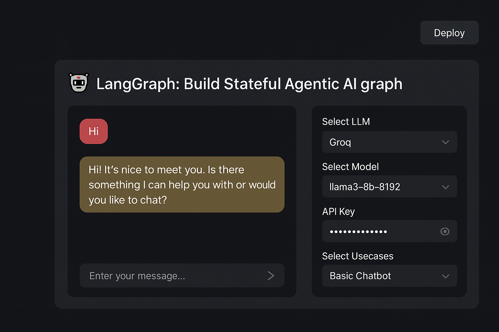

# Agentic AI Chatbot with LangGraph 🤖

This project is a **stateful Agentic AI chatbot** built using [LangGraph](https://python.langchain.com/docs/langgraph/), which allows you to design agent workflows as graphs. The chatbot supports **different LLMs**, **custom use cases**, and provides a **Streamlit-based UI** for easy interaction.

---

## 🚀 Features

* 🔹 **Agentic AI** powered by LangGraph.
* 🔹 Supports multiple **LLMs** (e.g., Groq, LLaMA).
* 🔹 **Configurable models** via dropdown.
* 🔹 **Custom use cases** such as basic chatbot mode.
* 🔹 **Streamlit UI** for user interaction.
* 🔹 Handles **stateful conversations**.

---

## 📂 Project Structure

```
AGENTICAICHATBOT/
│── src/
│   ├── langgraphagenticai/
│   │   ├── graph/
│   │   │   ├── graph_builder.py
│   │   ├── LLMS/
│   │   │   ├── groqlm.py
│   │   ├── nodes/
│   │   │   ├── basic_chatbot_node.py
│   │   ├── state/
│   │   │   ├── state.py
│   │   ├── tools/
│   │   ├── ui/
│   │   │   ├── streamlitui/
│   │   │   │   ├── display_result.py
│   │   │   │   ├── loadui.py
│   │   │   │   ├── uiconfigfile.py
│── app.py                # Entry point for Streamlit app
│── requirements.txt      # Dependencies
│── README.md             # Documentation
```

Code is private, but feel free to reach out if you'd like to discuss the implementation.

---

## 🖥️ User Interface

The chatbot is powered by **Streamlit**, giving an intuitive UI:

* Select LLM (e.g., Groq).
* Select Model (e.g., LLaMA).
* Enter API Key.
* Choose Use Case (e.g., Basic Chatbot).
* Start chatting with the agent.



---

## 🔑 Environment Variables

Before running, set your API keys in `.env` or directly in the UI:

* `GROQ_API_KEY`
* `LLAMA_API_KEY` (if applicable)

---

## 📖 Example Use Case

**Basic Chatbot Mode**

* Ask: `Hi`
* Response: `Hi! It's nice to meet you. Is there something I can help you with or would you like to chat?`

---

## 🛠️ Tech Stack

* [LangGraph](https://python.langchain.com/docs/langgraph/)
* [LangChain](https://www.langchain.com/)
* [Streamlit](https://streamlit.io/)
* Python 3.10+

---

## 📌 Future Improvements

* Add more **use cases** (retrieval, tools, memory, etc.).
* Support **multiple agents** in one graph.
* Deploy on **cloud platforms** (Streamlit Cloud, AWS, GCP, etc.).