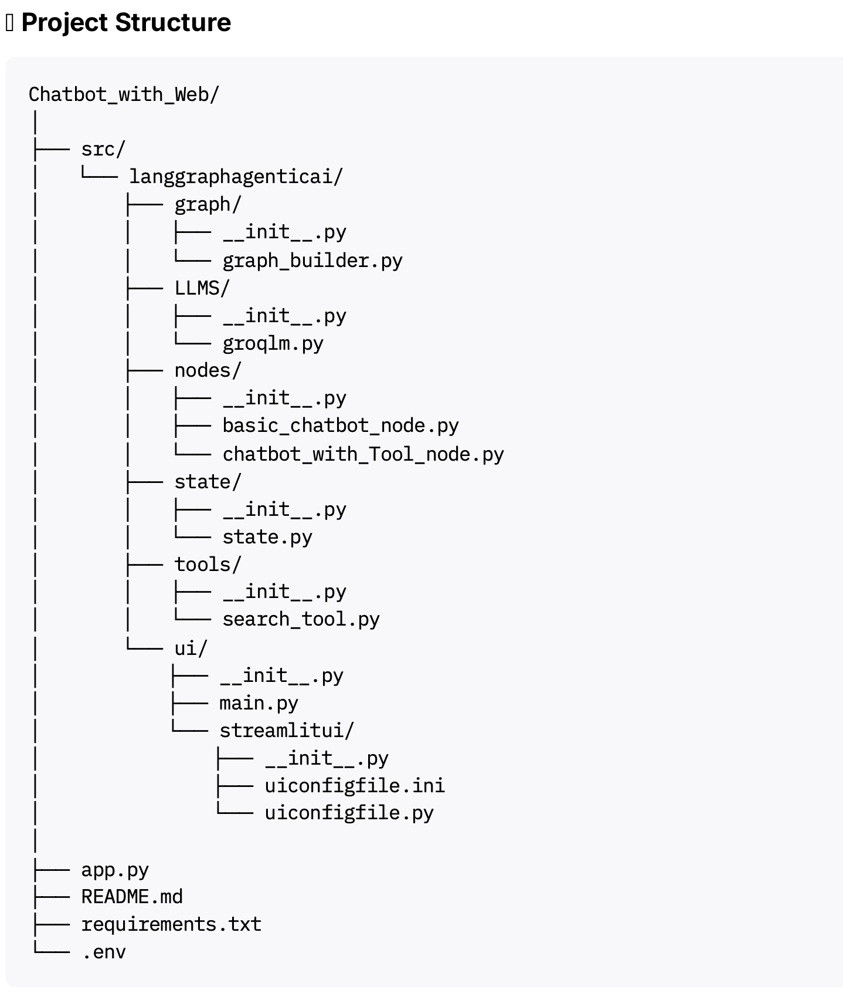
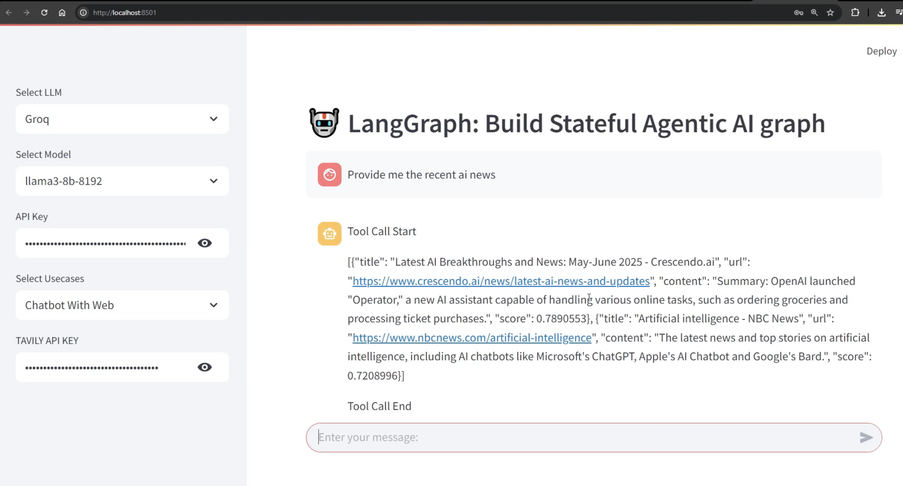

# Agentic AI Chatbot including Basic Chatbot and Chatbot with Web using LangGraph 🤖

This project is a **stateful Agentic AI chatbot** built using [LangGraph](https://python.langchain.com/docs/langgraph/), designed for flexible agent workflows as graphs. The chatbot now supports **multiple LLMs**, **custom use cases**, and **web search via Tavily API**, all integrated into a **Streamlit-powered UI** for seamless user interaction.

---

## 🚀 Features

* 🔹 **Agentic AI** workflow powered by LangGraph.
* 🔹 **Multiple LLM support:** Easily swap backend models (e.g., Groq, LLaMA).
* 🔹 **Configurable models and tools** via dropdown selectors in the UI.
* 🔹 **Multiple Use Cases:**

  * Basic Chatbot
  * Chatbot with Web Search (using Tavily API)
* 🔹 **Streamlit UI:** Modern and simple interaction.
* 🔹 **Stateful conversations:** Conversation history and context retention.
* 🔹 **Web search enabled:** Use Tavily API for up-to-date information from the internet.

---

## 📂 Project Structure

**Screenshot of Project Structure:**

---

## 🖥️ User Interface

The enhanced Streamlit UI provides:

* **LLM Selection:** Dropdown to choose from supported LLMs (e.g., Groq, LLaMA).
* **Model Selection:** Select available models.
* **API Key Entry:** Submit your API keys right in the app.
* **Use Case Selection:**

  * **Basic Chatbot:** Regular conversational agent.
  * **Chatbot with Tools:** Chatbot can access additional tools.
  * **Chatbot with Web:** Chatbot can fetch real-time information from the web via Tavily API.
* **Easy Chat Experience:** Enter messages and see contextual replies.
* **Web Search Demo:** Try prompts like *“latest AI news”* to see live results.

**Example UI:**

---

## 🔑 Configuration & API Keys

Set your keys in a `.env` file or enter them via the Streamlit UI:

* `GROQ_API_KEY` – For Groq LLM.
* `LLAMA_API_KEY` – For LLaMA (if used).
* `TAVILY_API_KEY` – **Required for Chatbot with Web use case** to enable live web search.

---

## 📖 Example Use Cases

### **Basic Chatbot**

* Ask: `Hi`
* Response: `Hi! It's nice to meet you. Is there something I can help you with or would you like to chat?`

### **Chatbot with Web**

* Ask: `Provide me the recent AI news`
* Response: *(Bot summarizes the latest articles using Tavily API)*

---

## 🛠️ Tech Stack

* [LangGraph](https://python.langchain.com/docs/langgraph/)
* [LangChain](https://www.langchain.com/)
* [Streamlit](https://streamlit.io/)
* **Tavily API** (for web integration)
* Python 3.10+

---

## 📌 Future Improvements

* Add more **use cases** (e.g., retrieval augmentation, advanced tools, multi-step workflows).
* Support **multi-agent graphs** and teamwork.
* Options for **cloud deployment** (Streamlit Cloud, AWS, GCP, etc.).

---

## 📝 Notes

* The app is modular — you can add new models or tools easily in the `src/langgraphagenticai/` structure.
* Web search requires a valid Tavily API key.
* For development or extension, see the module breakdowns in the source structure.

---

✨ **Enjoying this learning curve towards next-generation agentic AI chat with tools and live web search, all in one UI!**

