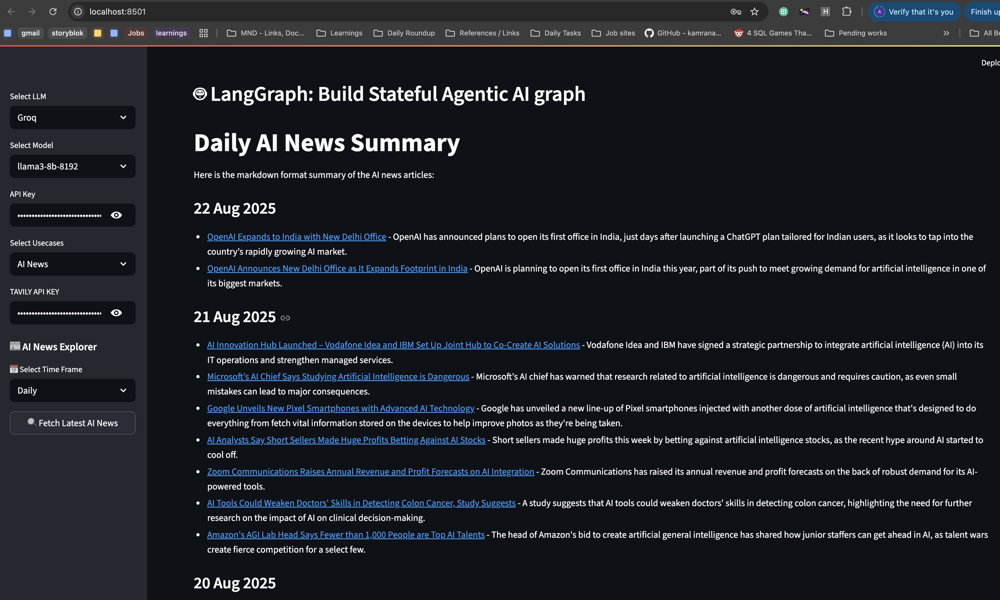

# Agentic AI Chatbot using LangGraph 🤖 — From Simple Conversations to Web Tools and AI News Feeds

This project is a **stateful Agentic AI chatbot** built using [LangGraph](https://python.langchain.com/docs/langgraph/), designed for flexible agent workflows as graphs. The chatbot supports **multiple LLMs**, **custom use cases**, and **live AI news summaries via Tavily API**, all integrated into a **Streamlit-powered UI** for seamless user interaction.

---

## 🚀 Features

* 🔹 **Agentic AI workflows** powered by LangGraph.  
* 🔹 **Multiple LLM support:** Easily switch between Groq, LLaMA, and others.  
* 🔹 **Configurable tools and models** via Streamlit UI dropdowns.  
* 🔹 **Multiple Use Cases:**  
  - Basic Chatbot  
  - Chatbot with Web Search (via Tavily API)  
  - **AI News Explorer (new!)** → Fetch & summarize AI news daily, weekly, monthly  
* 🔹 **Stateful conversations** with retained context.  
* 🔹 **Web search integration:** Access up-to-date information dynamically.  

---

## 📂 Project Structure

** Attaching screenshot of Project Structure below **  


---

## 🖥️ User Interface

The Streamlit UI now includes an **AI News Explorer** panel:

* **LLM Selection:** Choose supported models (e.g., Groq, LLaMA).  
* **Model Selection:** Select from available models.  
* **API Key Entry:** Input your API keys securely.  
* **Use Case Selection:**  
  - **Basic Chatbot:** Regular conversational agent.  
  - **Chatbot with Tools:** Extend with extra capabilities.  
  - **AI News:** Summarize AI news from India and globally using Tavily API.  
* **Time Frame Selection:** Fetch AI news **daily**, **weekly**, **monthly**  
* **One-click fetch:** Press **"Fetch Latest AI News"** to get summarized articles.  

### **Example: Monthly AI News Summary**


---

## 🔑 Configuration & API Keys

Set your keys in a `.env` file or enter them directly via the Streamlit UI:

* `GROQ_API_KEY` - For Groq LLM.
* `LLAMA_API_KEY` - For LLaMA (if used).
* `TAVILY_API_KEY` - **Required for AI News Explorer to fetch real-time news.**

---

## 📖 Example Use Cases

### **Basic Chatbot**

* Ask: `Hi`
* Response: `Hi! It's nice to meet you. Is there something I can help you with or would you like to chat?`

### **Chatbot with Web**
- Ask: `Provide me the recent AI news`
- Response: *(Bot summarizes latest articles; uses Tavily API for search)*

### **AI News Explorer**

* Ask: `Provide me the recent AI news`
* Select **Monthly** → Bot fetches and summarizes articles like:

  ```markdown
  2025-06-07
  - Consumer watchdog directs ecommerce platforms to conduct self-audits...
    [link](https://yourstory.com/2025/06/consumer-watchdog-directs-ecommerce-platforms-to-conduct-self-audits)

  2025-06-04
  - Meraqui: Building Bharat's Workforce OS with Tech, Trust, and Vision...
    [link](https://yourstory.com/2025/06/meraqui-workforce-ai-platform-india)
  ```

---

## 🛠️ Tech Stack

* [LangGraph](https://python.langchain.com/docs/langgraph/)
* [LangChain](https://www.langchain.com/)
* [Streamlit](https://streamlit.io/)
* **Tavily API** (for web integration)
* Python 3.10+

---

## 📌 Future Improvements

* Support **multi-agent graphs** and teamwork.
* Options for **cloud deployment** (Streamlit Cloud, AWS, GCP, etc.).

---

## 📝 Notes

* The app is modular — you can add new models or tools easily in the `src/langgraphagenticai/` structure.
* Web search requires a valid Tavily API key.
* For development or extension, see the module breakdowns in the source structure.

---

**Enjoy next-generation agentic AI chat with tools, live web search, and AI news summaries — all in one UI!**

Github Code Link : https://github.com/AlekhyaR/Agentic-Chatbot
